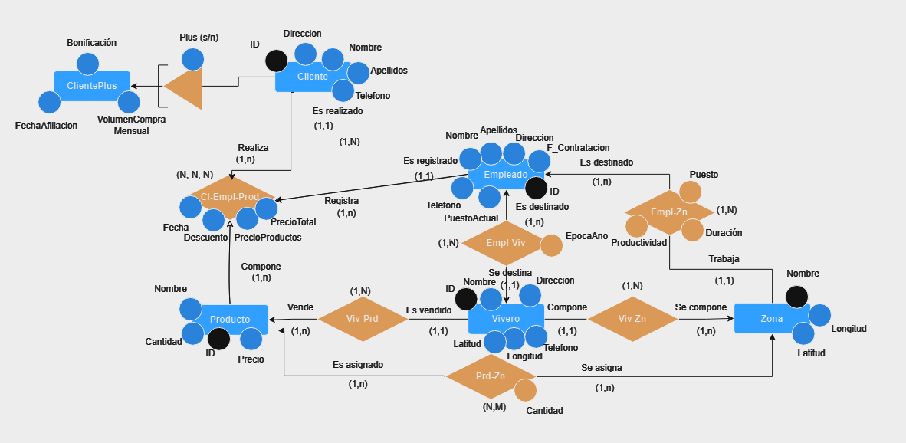

# Modelo Relacional. Viveros

* Kevin Salcedo Santana (_alu0101426846@ull.edu.es_)
* Marcos Padilla Herrera (_alu0101045177@ull.edu.es_)

## Introducción.
En anteriores sesiones se ha elaborado un modelo entidad-relación sobre viveros.

A partir de este diagrama se propone crear el modelo relacional asociado a este 

## Tablas creadas a partir del Modelo Entidad-Relación

* **Vivero** (ID, Nombre, Direccion, Telefono, Longitud, Latitud)
  * Primary Key => ID

* **Zona** (ID, Nombre, Longitud, Latitud, ID_Vivero)
  * Primary Key => ID
  * Foreign Key => ID_Vivero

* **Producto** (ID, Nombre, Precio, Cantidad_Stock, ID_Vivero)
  * Primary Key => ID
  * Foreign Key => ID_Vivero

* **ProductoZona** (ID_Producto, ID_Zona, Cantidad)
  * Primary Key => ID_Producto, ID_Zona
  * Foreign Key => ID_Producto, ID_Zona

* **Empleado** (DNI, Nombre, Apellidos, Direccion, Telefono, Fecha_Contratacion, ID_Vivero, ID_Zona, PuestoActual, Productividad)
  * Primary Key => DNI
  * Foreign Key => ID_Vivero, ID_Zona

* **EmpleadoZona** (DNI, ID_Zona, Puesto, Productividad, Fecha_Incio, Fecha_Fin, Duración)
  * Primary Key => DNI, ID_Zona
  * Foreign Key => DNI, ID_Zona

* **Cliente** (DNI, Nombre, Apellidos, Telefono, Plus)
  * Primary Key => DNI

* **ClientePlus** (ID, Volumen_Compra_Mensual, Fecha_Afliciacion)
  * Primary Key => ID
  * Foreign Key => ID

* **Pedido** (DNI_Cliente, DNI_Empleado, ID_Producto, Fecha, Descuento, PrecioProducto, PrecioTota)
  * Foreign Key => DNI_Cliente, DNI_Empleado, ID_Producto

## Enumeraciones

#### Enumeración con las distintas ocupaciones que puede tener un Empleado

* **PuestoEnum** ENUM ('Gerente', 'Supervisor', 'Vendedor', 'Cajero', 'Jardinero')
